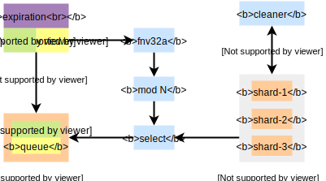

# go-cache

[](https://godoc.org/github.com/blinklv/go-cache)
[](LICENSE)

A concurrent-safe cache for applications running on a single machine in [Go][]. It supports set operation with expiration. Elements are not stored in a single pool ([map][]) but distributed in many seperate regions, which called shard. This design allows us to improve concurrency and perform some massive operations (like *cleaning expired elements*)progressively.

## Installation

```bash
$ go get github.com/blinklv/go-cache
```

## Internal



In the above picture, blue rectangles and other color ones usually represent operation and object respectively (*cleaner* is special). Commonly, arrows mean how data do flow. Now, let's look what will happen when you store an element with expiration. I don't explain the internal process of other operations because they're similar and even simpler.

1. Your element have three components, **key**, **value** and **lifetime**. The key ([string][] type) of the element will be converted to a 32-bit integer by using 32-bit [FNV-1a][] hash, the result of which we call it **sum** here.
2. Our cache is not a single pool but contains may seperate regions, which called **shard** here. We use a shard to store your element. But how do we choose that one? All shards of the cache are organized in array form; we can use the **sum** computed in the previous step to generate an index to get one. Using [modulo][] operation can do this easily,just like `i = sum mod N` (We assume the number of shards in the cache is **N**). We record the shard selected finally as **shard-x**. 
3. There're two primary components in a shard, **map** and **queue**. The former is a raw [map][] of [Go][], which can do the mapping `key -> {value, lifetime}`. Each element will have a backup in this map. The latter is a custom queue, the item of which likes `{key, lifetime}`. A element will push to it only when its lifetime is not zero. The reason why this struct exists you can see the next step. So when we store the element to the shard, it must be written to the map and might be pushed to the queue.
4. Let's we talk about something that will happen when your element expired. You won't get it, of course, this is why we set its expiration. But it doesn't mean your element has been removed from the cache (or shard-x). After a while, *cleaner* begins running. It's a goroutine which periodically cleans expired elements of the cache. If it checks all elements whether they expired by using [for][] statement with a [range][] clause iterates through all entries of the map, this cause the shard can't be accessed by other operations for a long time, because the shard is protected by the [read-write-lock][] and we usually don't interrupt this for-loop. So the **queue** component is included to the shard. It has two primary advantage; the first is we don't need to care about permanent elements; the second is we can iterate expired elements progressively. But it also consumes more memory and CPU cycles. Pop indices from the queue one by one, delete corresponded element when we find it expired. 

[Go]: https://golang.org/
[map]: https://golang.org/ref/spec#Map_types
[string]: https://golang.org/ref/spec#String_types
[FNV-1a]: https://en.wikipedia.org/wiki/Fowler%E2%80%93Noll%E2%80%93Vo_hash_function#FNV-1a_hash
[modulo]: https://en.wikipedia.org/wiki/Modulo_operation
[for]: https://golang.org/ref/spec#For_statements
[range]: https://golang.org/ref/spec#RangeClause
[read-write-lock]: https://en.wikipedia.org/wiki/Readers%E2%80%93writer_lock
